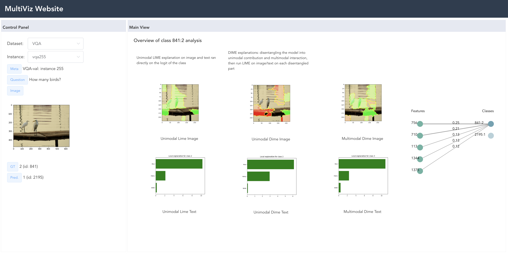

# MultiViz website
This is the website for MultiViz project. It visualizes and demos the analytical results of data points from the *VQA, MOSEI, MM-IMDB, MIMIC, and Flickr* datasets. 

You can run the visualization website by setting up the frontend as follows.
```
cd frontend
npm install
npm run serve
```

Environment:
- vue@2.6.12
- d3v5

Website screenshot:

